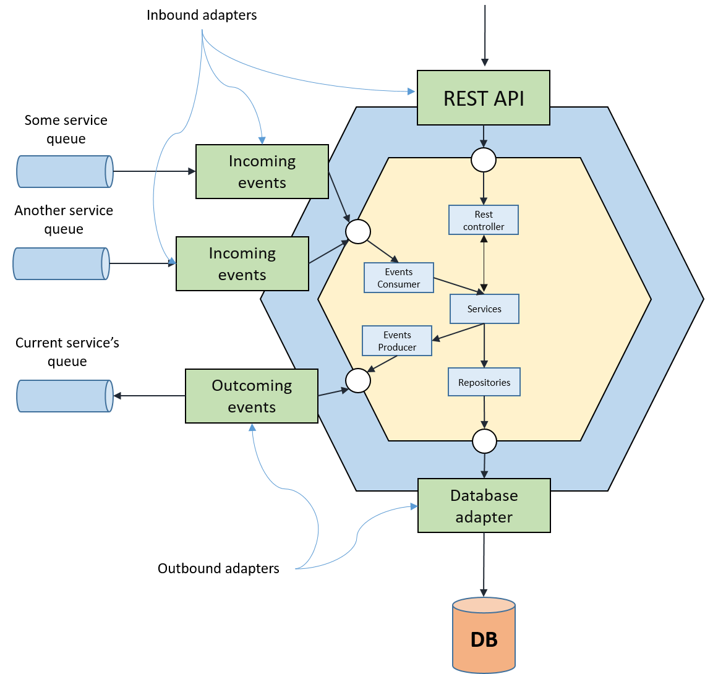

# Designing microservices course
This repository contains demo project which can be used by ITMO students enrolled in "Microservices architecture basics"
course.

## Disclaimer
Project is created to demonstrate main approaches and some of patterns which are used for creating microservices-based
systems. Some of architectural decisions were made to artificially complicate the system in order to demonstrate 
microservices patterns. Some business logic parts were simplified because this is not a real-world application. Some of 
the services or business logic are just a mocks. We aimed to create a decent example with somewhat clear, tested code 
with logging and without duplicates. However it cannot be considered as a source of coding best practices.

## Overview

TODO sukhoa : here should be description of the system.
### Business process description
Project consists of several services communicating to ensure proper execution of some business processes. 

### Architecture overview
Typically each individual service is just a small monolith or hexagonal application responsible for data and operations 
from some certain business area. For example order management, user management etc. Service may have a number of inbound
and outbound channels. Inbound channels enable service to receive data from the outside. There are different types of data:
client request, some event, resource state or whatever. Inbound channels are 
represented by REST API of the service and the queues or topics on which the service is subscribed. REST API calls 
may sometimes overlay or simply duplicate messaging API logic. In our particular case REST API calls were used for testing
purposes and to simply make developer’s life easier. REST API and 
messaging API should be designed to be consistent - REST calls and equivalent messaging call should always lead to same 
results in system and produce the same response. We achieve this by always delegating all the business operations to 
the services layer. Data from inbound channels regardless of its nature are processed by the services (we mean internal 
services, DDD term) of the microservice. Only services are responsible for all the business logic and there is no way 
to work around them. The only thing the REST API and messaging API layer are responsible for is to transform data into the 
form which may be fed to services. Note that equivalent APIs not necessarily have the same incoming data - just because 
the messaging API receives the messages and the REST API may receive some DTOs which may have slightly different structure
and some path/request parameters.

Outbound channels:
1. Message broker's queues and topics where services push outgoing events and messages 
1. Local datastore (DB, caches).

Services _do not_ have any shared entities or data structures and each service has its own schema in our Postgres instance 
which allows us:

1. Deploy services and migrate service’s schema and data independently
1. Switch to another DBMS (Polyglot persistence approach) at any time we decide without any impact to other services.

Services typically consist of two modules:
1. **app** module contains the implementation of service - properties,  services, controllers, DAOs, domain 
classes, utility classes. It is assembled into JAR/WAR file which might be executed or deployed to web/application server.
1. **api** module contains everything server would like to show to the outside world (more precisely to other services, 
because the only thing exposed to the outside is API Gateway). It may be some data structures (messages, requests, responses), 
connection info (message broker's queue and topic information), and REST Client implementation which allows others to consume server’s API
via java client wrapper.

TODO sukhoa: refactor following
### Used frameworks and libs
1. [Swagger UI](https://swagger.io/tools/swagger-ui/) - an open source project for RESTful services. Swagger automatically generates documentation and HTML for interacting with REST endpoints through UI. For projects with enabled Swagger (have `@EnableSwagger2` annotation in the main class): 
    * Swagger configuration in json format: http://{host}:{port}/v2/api-docs
    * Swagger UI: http://{host}:{port}/swagger-ui.html 
    
    {host} is localhost by default.
    {port} is configured with `server.port` property
1. Feign
1. Eureka Discovery service. [Setting up discovery service](eureka-service-discovery/README.md)
1. Kafka [Setting up kafka](kafka/README.md)
1. Protocol Buffers
1. Spring Cloud Sleuth - distributed tracing solution for Spring Cloud. Configured to sent tracing information to Zipkin.
1. [Zipkin](https://zipkin.io/) - a distributed tracing system. By default Spring Cloud Sleuth sends tracing information 
to localhost:9411. You can configure the location of the service using `spring.zipkin.baseUrl` property. Zipkin can be
run in separate container by performing `docker run -d -p 9411:9411 openzipkin/zipkin` command. Also can be ran as part of
our infrastructure services by invoking `docker-compose up` from the project root directory.
1. [Mircometer](https://micrometer.io/) - Vendor-neutral application metrics facade (just like slf4j for loggers). It
supports many different backends. To enable metrics pushing for a certain backend set property management.metrics.export.<backend-name>.enabled to true
or just set any property (e.g. management.metrics.export.<backend name>.step, which is metrics pushing frequency). To gather metrics 
you'll need to create some meter (Counter, Timer etc) and bind it to meter registry (spring boot auto configures one for 
each enabled backend and also creates a composite registry which meters will be pushed to all backends) 
1. Grafana [Grafana info](grafana/README.md) 

